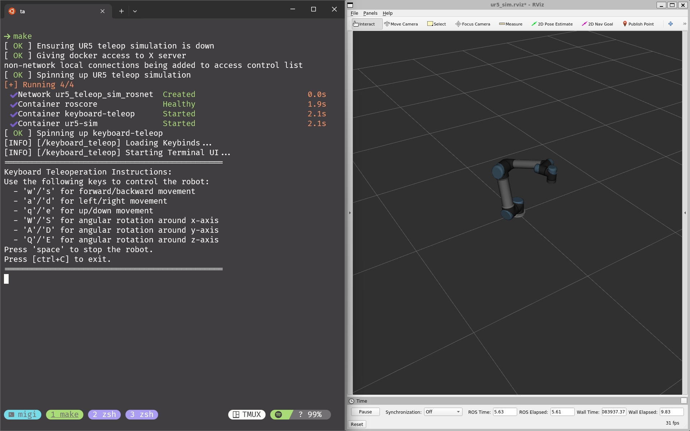

# UR5 Teleop Sim

[](https://github.com/pre-commit/pre-commit)
[](https://github.com/m-normand/ur5_teleop_sim/actions/workflows/ci-lint.yml)



A simple simulation that demonstrates teleop of a UR5 via keyboard

> [!WARNING]
> Work in progress... Mileage may vary...

- [Installation](#installation)
- [Usage](#usage)
- [Subdirs](#subdirs)
  - [keyboard-teleop](#keyboard-teleop)
  - [ur5-sim](#ur5-sim)
- [To Do](#to-do)

## Installation

The install script ensures the following are on your machine

- `docker`
- `make`
- `pre-commit`

To install

```bash
./install.sh
```

## Usage

Use **Makefile** targets instead of invoking `docker` directly

```bash
make all   # Starts Sim
make stop  # Ends Sim
make logs  # Read docker logs
make build # To rebuild containers after each change
```

Generally it is sufficient to run

```bash
make all
```

## Subdirs

### keyboard-teleop

Package for converting key-strokes into `TwistStamped` for the robot to act on.

### ur5-sim

Large package that hosts `gazebo` + `rviz` + `ur5_moveit_config`.
The core simulation to be manipulated.

## To Do

- [X] UR5 behaves strange from TwistStamped... [#9](https://github.com/m-normand/ur5_teleop_sim/pull/9)
- [X] Joint level control of robot
- [ ] First IK Solution
- [ ] Singularity Compensation
- [ ] Tracking Optimization
